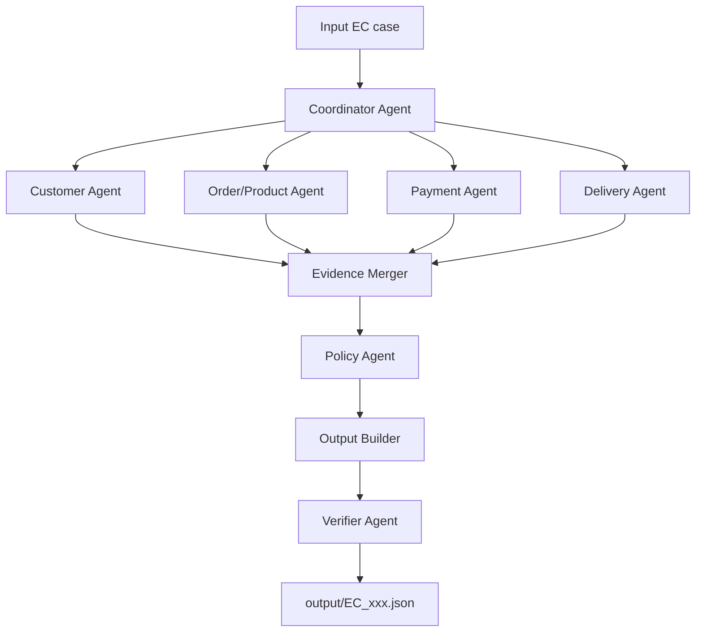

## Roles and access

| Agent | Responsibility | Data access | Handoff |
|---|---|---|---|
| Coordinator | Creates a case context and dispatches work | Input JSON and indexed case data | Sends context to specialist agents |
| Customer Agent | Resolves customer identity and history | customers, orders | Customer context and evidence |
| Order/Product Agent | Resolves items, sellers, products and categories | orders, order_items, products, sellers, translation | Entity context and evidence |
| Payment Agent | Reconciles payments with item and freight totals | order_payments, order_items | Payment calculations and evidence |
| Delivery Agent | Calculates delivery and seller handoff variances | orders, order_items | Delivery calculations and seller evidence |
| Policy Agent | Applies EC_POLICY_V2 and produces the decision | All specialist results | Issue, responsibility, refund and actions |
| Verifier Agent | Checks schema, IDs, limits and consistency | Final JSON and indexed data | Pass/fail before file write |

The implementation uses one sub-10B model identity in `metadata.json` for role-based agents. Numeric joins, timestamp arithmetic, policy predicates and validation are deterministic Python tools so that agents cannot invent evidence or alter source facts.
